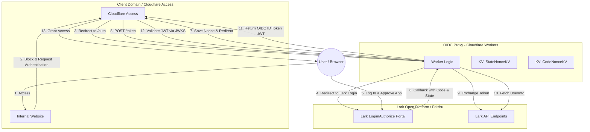
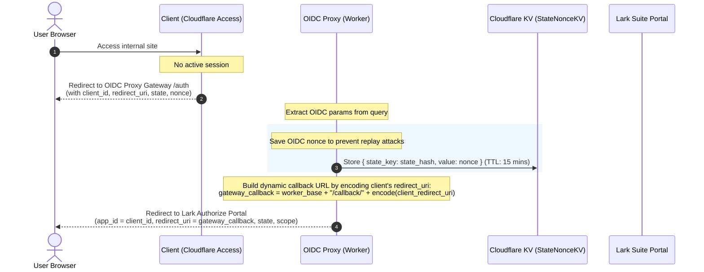
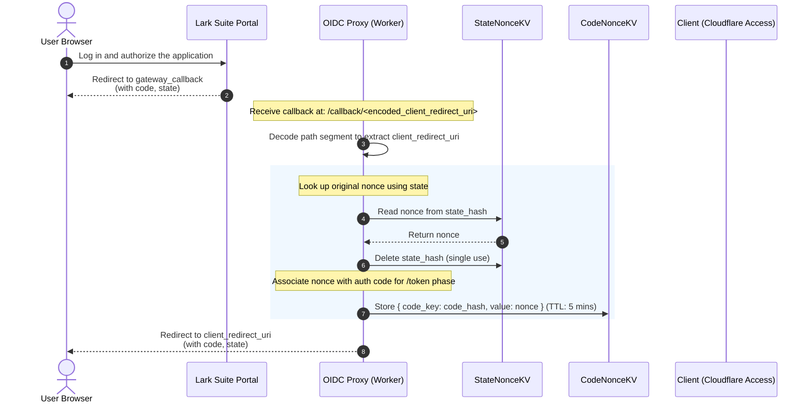
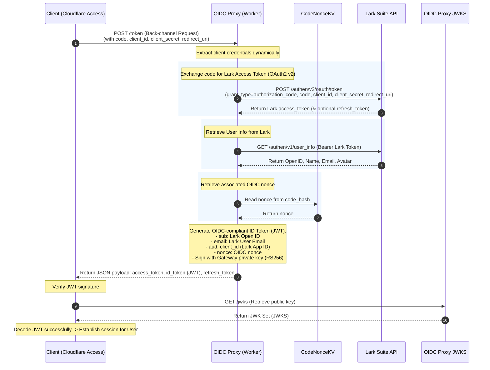

# Technical Design Document: Lark (Feishu) OIDC Proxy Gateway

This document describes the general architecture and sequence flows of the **OIDC Proxy Gateway** connecting a Client System (e.g., Cloudflare Access / Zero Trust) with the Identity Provider (Lark Suite / Feishu Open Platform).

A key feature of this design is its **dynamic multi-tenant architecture**, which eliminates the need to hardcode Client Credentials (Lark App ID/Secret) within the Gateway's configuration.

---

## 1. Overall Architecture Model

The OIDC Proxy Gateway acts as a protocol translation adapter at the edge. It translates standard OIDC requests from the client into Lark OAuth2 requests, and vice versa.

---

## 2. Dynamic Multi-tenant Design

In typical OIDC proxy setups, the `client_id` and `client_secret` of the Identity Provider (Lark) are hardcoded in the proxy server environment. 

This gateway removes that limitation by dynamically extracting credentials from incoming standard OIDC requests:

1. **Dynamic Client ID Extraction**:
   - When the client initiates authentication at the `/auth` endpoint, the Gateway extracts the `client_id` from the query parameters and forwards it to Lark as the `app_id`. Lark handles this as the App ID of the application requesting authentication.
2. **Dynamic Client Secret Extraction**:
   - When the client requests an authorization code exchange at the `/token` endpoint, the Gateway extracts the `client_id` and `client_secret` from either the standard `Authorization` header (Basic Authentication) or the request body (Form Data).
   - This credential pair is then passed directly to the Lark API to complete the OAuth2 flow.
3. **Dynamic Callback Routing**:
   - Because Lark requires pre-registered redirect URLs in its Developer Console, the Gateway encodes the client's actual destination redirect URL directly into its own callback path:
     `https://<gateway-domain>/callback/<encoded-client-redirect-uri>`
   - This approach lets the Gateway route responses to the correct client without maintaining an internal routing database or state mapping.

---

## 3. Sequence Flows

The following diagrams detail the authentication, callback, and token exchange sequences.

### Phase 1: Authorization Initiation

### Phase 2: Lark Callback & Authorization Code Forwarding

### Phase 3: Token Exchange & Identity Verification

---

## 4. State Management (KV Storage)

To maintain OIDC compliance (especially for anti-replay `nonce` verification), the Gateway uses Cloudflare KV namespaces for temporary storage:

1. **StateNonceKV**:
   - **Key**: `state` (truncated to 256 characters via `truncateState()`). *Currently only truncated, not hashed. TODO: Use SHA-256 for key sanitization.*
   - **Value**: The `nonce` value sent by the client. Only stored if a `nonce` parameter is present in `/auth`.
   - **TTL**: 900 seconds (15 minutes). Cleans up storage if the user abandons the login screen.

2. **CodeNonceKV**:
   - **Key**: `code` (truncated to 256 characters via `truncateCode()`).
   - **Value**: The associated `nonce` migrated from `StateNonceKV` during the callback phase.
   - **TTL**: 300 seconds (5 minutes). Maximum window allowed for the client to exchange the authorization code.

---

## 5. User Claims Mapping

Lark Suite returns different email formats depending on the organization settings. The Gateway maps these claims differently depending on the endpoint:

**a) ID Token (JWT) — Generated during `/token` exchange (`generateIdToken`)**

| OIDC Claim | Lark Source Value | Mapping Logic / Fallback |
| :--- | :--- | :--- |
| `iss` | `ISSUER_BASE_URL` | The Gateway's base URL issuer. |
| `sub` | `open_id` | Unique ID of the user within this Lark App. |
| `aud` | `client_id` | Matches the Lark App ID. |
| `name` | `name` | User's display name. |
| `email` | `enterprise_email` \| `email` \| `name@DOMAIN` | Prioritizes corporate email, then personal. If neither is available, generates `name@DOMAIN` (where DOMAIN defaults to `example.com`). ⚠️ See Known Limits. |
| `picture` | `avatar_url` | Avatar profile image. |
| `nonce` | KV Store (CodeNonceKV) | Added only if a `nonce` was present during `/auth`. |

**b) UserInfo Endpoint (`/userinfo`)** — Returns additional claims (Not embedded in the ID Token):

| OIDC Claim | Lark Source Value |
| :--- | :--- |
| `phone_number` | `mobile` (Optional) |
| `preferred_username` | `name` (Optional) |

> ⚠️ The `/userinfo` endpoint only reads `data.email` and does not apply the fallback logic (`enterprise_email` or `name@DOMAIN`) used in the ID Token. This inconsistency should be reviewed.

---

## 6. Key Design Benefits

- **Zero Maintenance**: You do not need to configure or redeploy the Gateway when protecting new applications. Simply register the new app on Lark Open Platform, configure Cloudflare Access, and the gateway handles credentials dynamically.
- **Serverless & Edge Native**: Deployed on Cloudflare Workers, providing fast response times (< 50ms) and minimal operational overhead.
- **In-Transit Secrets**: Client Secrets are processed in-transit during the token exchange and are never persisted in KV or log storages. *Note: Since the secret is visible in Worker memory during processing, the host must trust the gateway code.*

---

## 7. Endpoint Management (`IssuerHelper`)

Path composition logic is central to `src/utils/issuer.ts` (`IssuerHelper`). It dynamically builds paths based on environment variables:

- **Validation**:
  - `ISSUER_BASE_URL` is required and must be a valid absolute URL. Trailing slashes are stripped.
  - Path variables (e.g., `ISSUER_AUTH_PATH`) must be relative paths (starting with `/`). Absolute URLs are forbidden here to avoid DNS routing discrepancies.
  - `ISSUER_CALLBACK_PREFIX` is normalized with leading and trailing slashes.
- **Security Guards**:
  - If `ISSUER_BASE_URL` contains sub-paths, queries, or hashes, initialization throws an error.
  - If `ISSUER_CALLBACK_PREFIX` is set to `/`, it throws an error to prevent matching all routes.

---

## 8. Gateway Endpoint Reference

| Path (Default) | Method | Description | Configuration Variable |
| :--- | :--- | :--- | :--- |
| `/.well-known/openid-configuration` | GET | OIDC Discovery Metadata | *(Fixed)* |
| `/auth` | GET | Receives OIDC request and redirects to Lark | `ISSUER_AUTH_PATH` |
| `/callback/<encoded-redirect-uri>` | GET | Receives Lark auth code and forwards to client | `ISSUER_CALLBACK_PREFIX` |
| `/token` | POST | Exchanges auth code for tokens and issues OIDC JWT | `ISSUER_TOKEN_PATH` |
| `/userinfo` | GET | Proxies UserInfo requests to Lark | `ISSUER_USERINFO_PATH` |
| `/jwks` | GET | Exposes the JWKS public key set | `ISSUER_JWKS_PATH` |

---

## 9. Environment Variables Reference

| Variable | Required | Description |
| :--- | :--- | :--- |
| `ISSUER_BASE_URL` | Yes | Public URL of the Worker (`iss` claim). No trailing slash. |
| `JWT_PRIVATE_KEY_PEM` | Yes (Secret) | RS256 private key PEM used to sign OIDC ID tokens. |
| `JWT_PUBLIC_KEY_JWK` | Yes | Public key JWK (Must not contain private parameters like `d`). |
| `JWT_KEY_ID` | Yes | Key Identifier (`kid`), must match the JWK `kid`. |
| `DOMAIN` | No | Default fallback domain for generated emails (Defaults to `example.com`). |
| `ALLOWED_REDIRECT_URIS` | No | Comma-separated list of allowed client redirect URLs. If empty, all URLs are allowed. Recommended to set in production. |
| `LARK_MODE` | No | Set to `true` for Lark Suite (Global). Omit or set to `false` for Feishu (China). |
| `DEBUG_PAGE` | No | Set to `false` in production to disable the interactive testing console `/test`. |
| `ISSUER_AUTH_PATH` ... | No | Custom overrides for OIDC path names. |
| KV Bindings | Yes | `StateNonceKV` and `CodeNonceKV` bindings in `wrangler.jsonc`. |

---

## 10. Scope Mappings (OIDC ↔ Lark)

The Gateway maps OIDC scopes to Lark API scopes during authorization (`transformOpenIDScope`) and handles the inverse mapping during token response (`transformFeishuScope`).

| OIDC Scope | Corresponding Lark Scopes |
| :--- | :--- |
| `profile` | `contact:user.base:readonly` |
| `email` | `contact:user.email:readonly`, `directory:employee.base.email:read`, `directory:employee.base.enterprise_email:read` |
| `sub` *(Inferred)* | `contact:user.id:readonly`, `contact:user.base:readonly`, `contact:user.employee_id:readonly` |
| `openid` | *(Processed internally; not sent to Lark)* |

> Make sure these scopes are enabled in your **Lark Developer Console → Permission Management** and the application version is published.

---

## 11. Cloudflare Access IdP Settings (Generic OIDC)

Configure the OIDC settings manually in Cloudflare Zero Trust:

| Cloudflare Access Field | Value |
| :--- | :--- |
| **Client ID** | Lark App ID (`cli_xxx`) |
| **Client Secret** | Lark App Secret |
| **Auth URL** | `${ISSUER_BASE_URL}/auth` |
| **Token URL** | `${ISSUER_BASE_URL}/token` |
| **Certificate (JWKS) URL** | `${ISSUER_BASE_URL}/jwks` |

**Redirect URI in Lark Console**:
`${ISSUER_BASE_URL}/callback/<encoded-CF-Access-callback>`
*(Where the CF Access callback format is `https://<team-name>.cloudflareaccess.com/cdn-cgi/access/callback`)*.

---

## 12. Known Limitations & Security Considerations

| ID | Issue | Severity | Description / Mitigation |
| :--- | :--- | :--- | :--- |
| 1 | **Email Fallback `name@DOMAIN`** | High | Generating pseudo-emails if the Lark account lacks an email claim may allow identity spoofing. We recommend enforcing corporate emails or checking domain matches carefully on the client. |
| 2 | **Unhandled Lark API Error Codes** | Medium | If `/token` request fails on Lark's side, `userInfoFeishu.code` is unchecked, which can lead to a 500 error on the Gateway. |
| 3 | **Double URI Encoding** | Medium | The `redirect_uri` might be double-encoded during code exchange. Ensure values match precisely. |
| 4 | **Truncated State/Code Hashing** | Low | KV keys are currently truncated to 256 characters instead of hashed. Hashing using SHA-256 is recommended to avoid potential collision risks. |
| 5 | **No PKCE Support** | Low | The gateway acts as a pass-through; state verification is deferred to the relying party (Cloudflare Access). |
| 6 | **Refresh Tokens Unavailable** | Low | `offline_access` is currently not advertised or fully implemented. |
